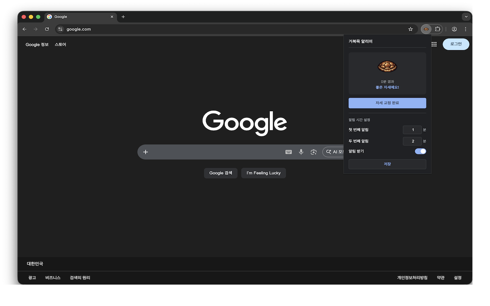

# 거북목 알리미 (Turtle Neck Reminder)

<!--  -->
 
<!--  -->

브라우저 사용 시간에 따라 자세 교정을 알려주는 Chrome 확장프로그램입니다.

## 기능

- ⏱️ **자동 타이머**: 브라우저 시작 시 자동으로 시간 측정
- 🔔 **시스템 알림**: 설정한 알림 시간(단일 기준)에 도달하면 자세 교정 알림
- 🎨 **2단계 상태 표시**: 시간 경과에 따라 `좋음 → 위험` 상태로 아이콘/문구 변경
- ⚙️ **시간 설정**: 알림 시간을 원하는 분 단위로 조절
- 🦒 **알리미 선택**: 거북이/기린 캐릭터 선택 가능
- 🌐 **다국어 지원**: 한국어/영어/일본어 로케일 제공
- 🌙 **다크모드**: 시스템 설정에 맞춰 자동 적용

## 아이콘 변화

| 시간 | 아이콘 | 상태 |
|------|--------|------|
| 0분 ~ |  | 좋은 자세예요! |
| 알림 시간 도달 후 |  | 지금 바로 스트레칭하세요! |

## 설치 방법

### Chrome 웹스토어
[바로가기](https://chromewebstore.google.com/detail/dnojahjhfhgblnfggidnhjnjmfeeenmi?utm_source=item-share-cb)

### 개발자 모드 설치
1. 이 저장소를 클론하거나 다운로드
2. Chrome에서 `chrome://extensions/` 접속
3. "개발자 모드" 활성화
4. "압축해제된 확장 프로그램을 로드합니다" 클릭
5. 다운로드한 폴더 선택

## 사용 방법

1. 설치 후 브라우저 툴바의 거북이 아이콘 확인
2. 아이콘 클릭으로 현재 상태 확인
3. "자세 교정 완료" 버튼으로 타이머 리셋
4. 설정에서 알림 시간, 알림 on/off, 알리미(거북이/기린) 선택 가능

## 기술 스택

- Manifest V3
- Chrome Alarms API
- Chrome Storage API
- Chrome Notifications API
